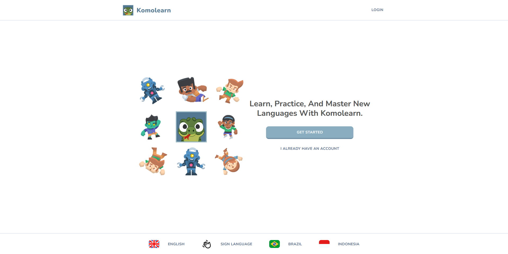
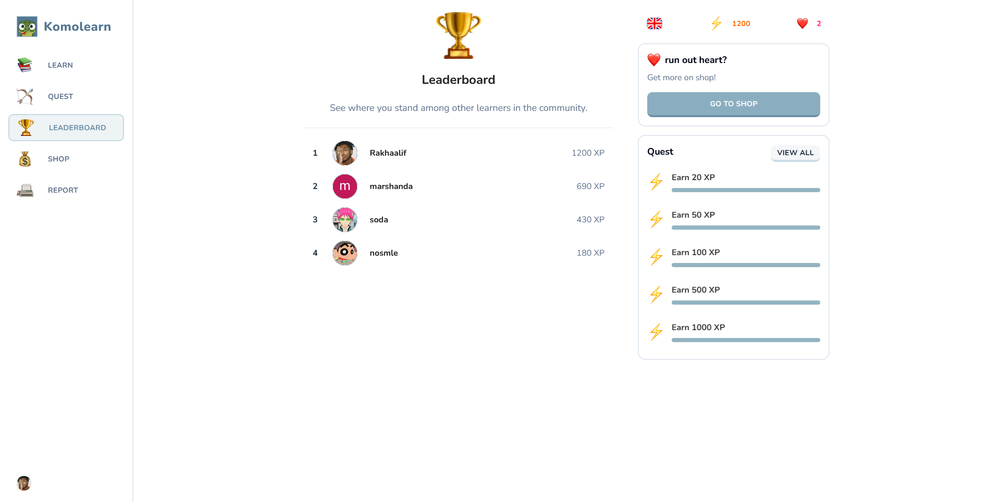
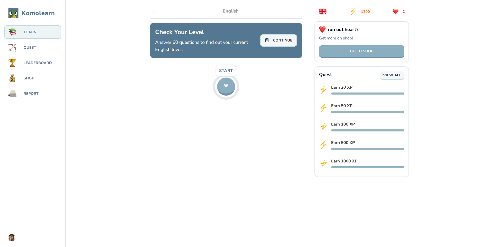
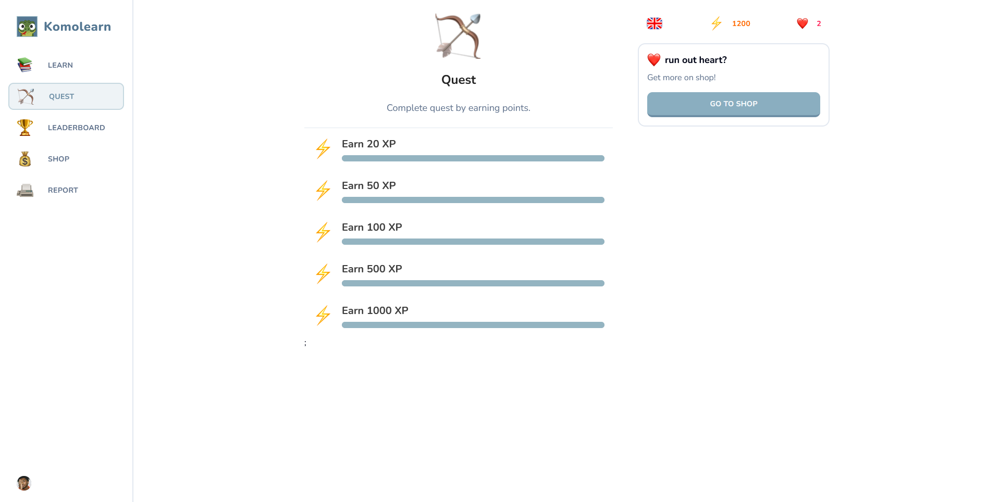
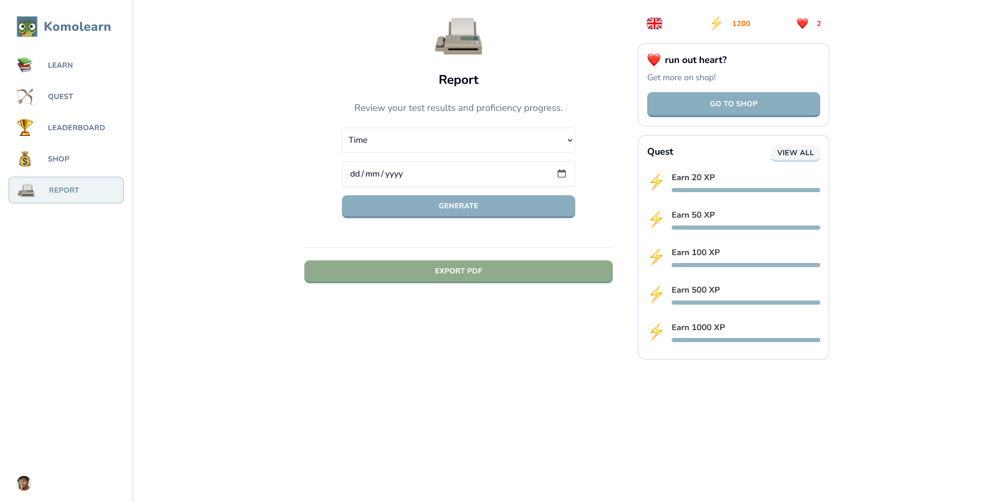

<h1 align="center"> Komo Learn</h1>

<p align="center">
  🧠 Smart English Learning Platform powered by Fuzzy Logic
</p>

<p align="center">
  <a href="https://komo-learn.vercel.app">
    
  </a>
</p>

<p align="center">
  
  
  
</p>

<p align="center">
  
  
</p>


<p align="center">https://komo-learn.vercel.app</p>

---

## 📸 UI Preview
<p align="center">
  
  
</p>

<p align="center">
  
  
</p>

<p align="center">
  
</p>

---

## 📖 About The Project

**Komo Learn** adalah platform pembelajaran Bahasa Inggris berbasis web yang menggabungkan:

* ✨ Interactive Learning
* 🧠 Fuzzy Mamdani Logic
* 📊 Smart Performance Analysis

🎯 **Tujuan utama:**
Menentukan level kemampuan user secara **adaptif & akurat**, bukan sekadar nilai.

---

## ⚡ Key Features

### 📚 Learning System

* Vocabulary
* Listening (Audio-based)
* Reading
* Grammar

### 🧠 Smart Level Detection

* Menggunakan **Fuzzy Mamdani**
* Parameter:

  * Score
  * Time
  * Accuracy

### 🎯 Quiz Engine

* Assist Mode
* Auto progression *(tanpa blokir jawaban salah)*

### 📊 Report System

* History test
* Analisis performa
* Rekomendasi belajar

### 🖨️ PDF Export

* Multi-page report
* Header & footer
* Page number

### 🔐 Authentication

* Clerk Auth *(secure login)*

---

## 🧠 Fuzzy Logic System

**Input:**

* Score (0–100)
* Time (seconds)
* Accuracy (%)

**Output:**

* Basic
* Intermediate
* Advanced

📌 **Contoh:**

```
Score = 90
Time = 620
Accuracy = 88

➡️ Result: ADVANCED
```

---

## 🏗️ Tech Stack

| Layer    | Tech                       |
| -------- | -------------------------- |
| Frontend | Next.js, React, TypeScript |
| Styling  | Tailwind CSS               |
| Backend  | Next.js Server Actions     |
| Database | PostgreSQL (Neon)          |
| ORM      | Drizzle ORM                |
| Auth     | Clerk                      |
| PDF      | jsPDF, html2canvas         |

---

## 📂 Project Structure

```
komo-learn/
│── app/
│   ├── (main)
│   ├── laporan
│   ├── lesson
│
│── components/
│── db/
│   ├── schema.ts
│   ├── queries.ts
│
│── public/
│── lib/
│── types/
```

---

## ⚙️ Getting Started

### 1️⃣ Clone Repository

```bash
git clone https://github.com/username/komo-learn.git
cd komo-learn
```

### 2️⃣ Install Dependencies

```bash
npm install
```

### 3️⃣ Setup Environment Variables

```env
DATABASE_URL=
NEXT_PUBLIC_CLERK_PUBLISHABLE_KEY=
CLERK_SECRET_KEY=
```

### 4️⃣ Run Development Server

```bash
npm run dev
```

---

## 🎯 Roadmap

* 📈 Progress Chart (visual analytics)
* 🤖 AI Recommendation
* 🌍 Multi-language support
---

## 👨‍💻 Author

**Rakha Alif Prayogi**

---

## ⭐ Support

Kalau project ini membantu:<br>
Kasih ⭐ di repository ya!

---

## 📄 License

MIT License
